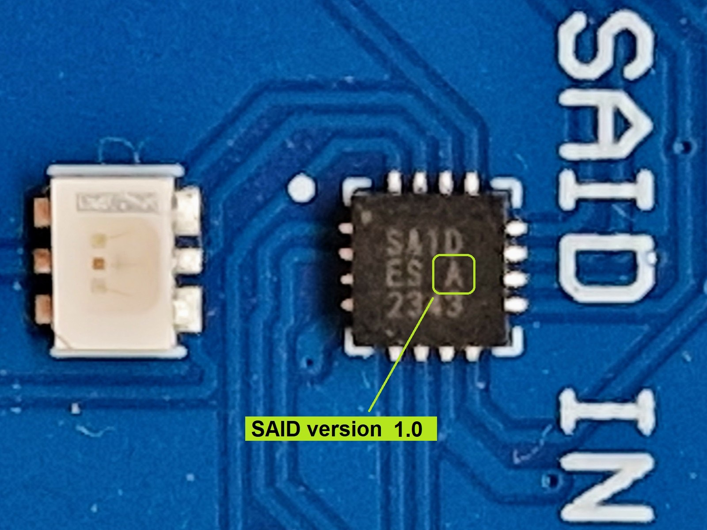
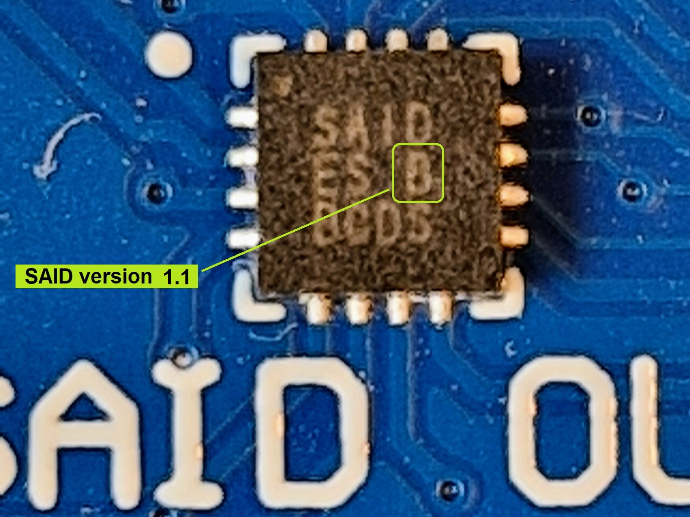

# SAID versions and variants

With _versions_ we mean different products in time 
where newer ones replace older ones.

With _variants_ we mean different products at the same time,
but they differ in feature set.

## Variants

The SAID comes in two variants (mid 2025).

- AS1163 a.k.a. SAID ([web](https://ams-osram.com/products/drivers/led-drivers/ams-as1163-automotive-9-output-stand-alone-intelligent-led-driver-ic))  
  Nine outputs with a maximum current of 48 mA (3×) or 24 mA (6×).
  
- AS1163B a.k.a. SAIDB ([web](https://ams-osram.com/products/drivers/led-drivers/ams-as1163b-automotive-6-output-stand-alone-intelligent-led-driver-ic))  
  Six outputs with a maximum current of 48 mA (6×).

## Versions of (plain) AS1163

The AS1163 comes in two versions

- Version 1.0  
  An engineering version, used in the EVK on some positions.  
  See the photo below, an "A" mark identifies version 1.0.

- Version 1.1  
  Customer qualified version, used in the EVK in some positions.  
  See the photo below, a "B" mark identifies a version 1.1.  
  Note that the "B" marking refers to version 1.1, not to SAIDB.

Version differences (not exhaustive)

- Version 1.0 has an extra clock transition in _response_ telegrams in _BiDir_ mode.
  For example see [aospi_mcua](https://github.com/ams-OSRAM/OSP_aospi/tree/main/examples/aospi_mcua).

- Version 1.0 and 1.1 use a different numbering scheme for the inputs ("channels") of the ADC.
  For example see [aoosp_adcpot](https://github.com/ams-OSRAM/OSP_aoosp/tree/main/examples/aoosp_adcpot).
  

(end)
