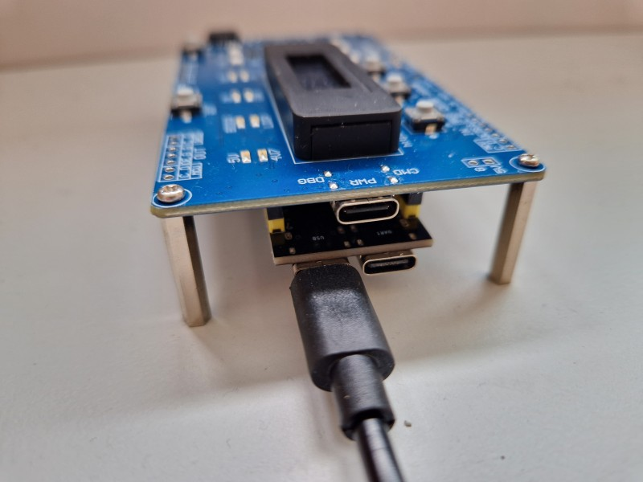
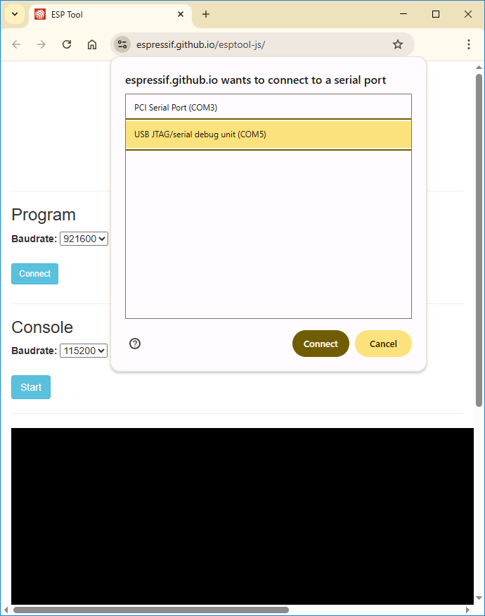
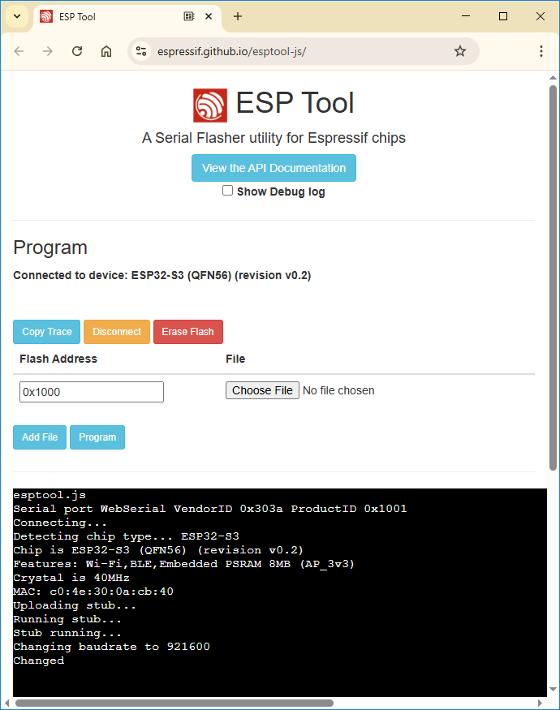
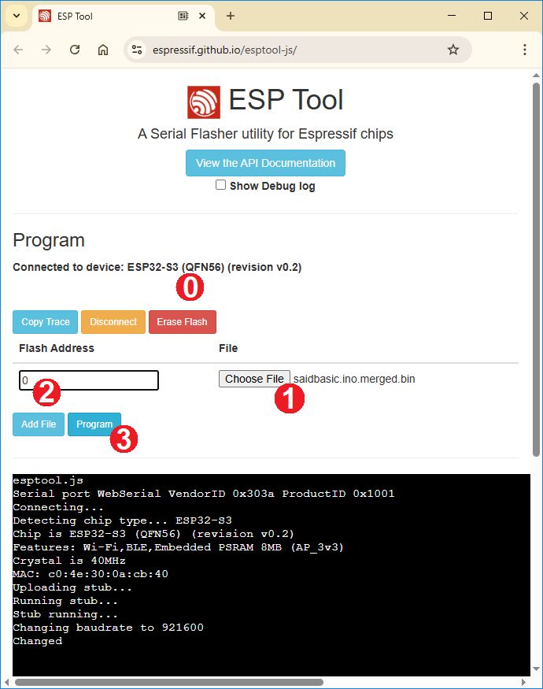
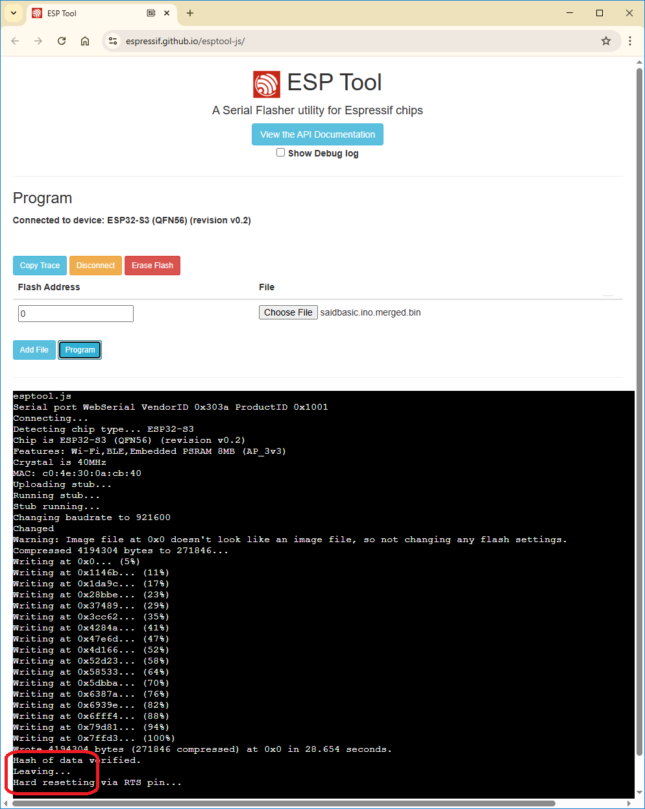

# Web flash

The ESP32S3 that is used in the evaluation kit can be flashed from a browser.
No need for dedicated tools.

## Binaries 

To flash an ESP from a browser you do need a binary file.
This is more involved than it sounds: a build for an ESP32
generates four binaries (bootloader, partition table, boot code 
and the sketch) and they each have to be flashed at a specific address.

However, with the menu entry _Sketch > Export Compiled Binary_ the 
Arduino IDE also generates a _merged_ binary; and that is what we 
will use for web flash.

For some sketches we store the compiled binaries in the sketch folder
in the repo so that they are easily accessible. We follow the file 
architecture of Arduino IDE; the _Sketch > Export Compiled Binary_ creates 
a directory `build` in the sketch folder, for example see 
[saidbasic](https://github.com/ams-OSRAM/OSP_aotop/tree/main/examples/saidbasic/build).
For web flash you would need [saidbasic.ino.merged.bin](https://github.com/ams-OSRAM/OSP_aotop/tree/main/examples/saidbasic/build/esp32.esp32.esp32s3/saidbasic.ino.merged.bin).

## Flashing

- USB a USB cable to connect the PC with the OSP32 board.
  It is suggested to use the port labeled "DBG" that seems to require
  no driver. 

  

  Using the port labeled "DBG" would require installation of the driver 
  for the CP2102N (the USB to serial bridge used on the ESP32-S3-DevKitC-1).
  Find that driver at [Silabs](https://www.silabs.com/interface/usb-bridges/usbxpress/device.cp2102n-gqfn28).

- Start a modern browser (Chrome, Edge; unfortunately Safari does not 
  support Web serial) and visit an ESP web flasher.
  We suggest [ESP Tool](https://espressif.github.io/esptool-js/) 
  from Espressif the manufacturer of ESPs. Alternative is 
  [Adafruit](https://adafruit.github.io/Adafruit_WebSerial_ESPTool/) 
  who cloned the Espressif page. They are very similar.
  
- With the "Console" pane you can view the prints over Serial.
  We ignore that here, we focus on the "Program" pane.
  
  The default baudrate (921600) is ok; click on the "Connect" button 
  in the "Program" pane. A security feature of the browser pops-up: 
  the user has to grant the browser access to the USB port. 
  

  

  Select the port and pres Connect.

- The browser page starts communicating with the ESP. 
  For example, we see it detects the ESP32-S3 (line 4).

  
  
  We also see that extra buttons are added to the UI.
  We ignore most of them; we need `Choose File` and `Program`.
  
- After successful connection (0), click `Choose File` (1) and browse to 
  an `xxx.ino.merged.bin` like [saidbasic.ino.merged.bin](https://github.com/ams-OSRAM/OSP_aotop/tree/main/examples/saidbasic/build/esp32.esp32.esp32s3/saidbasic.ino.merged.bin)

  
 
  Do not forget to set "Flash Address" to 0 (2), then press "Program" (3). 

  If you forget the 0 address in (2), the firmware will be flashed to the 
  wrong address and won't work. No harm done, just repeat the process,
  this time setting address to 0.
  
- After pressing "Program", wait. Flashing takes time.

  You will see the remark about the address 0x0 
  (hexadecimal for the 0 we entered at "Flash Address").
  Wait till you see the "Leaving..." message.

  
  
- The "Hard resetting" might not work; then press the RESET button 
  on the ESP32 board (or unplug and re-plug the USB cable).
  This should start the just flashed firmware image.

(end) 

