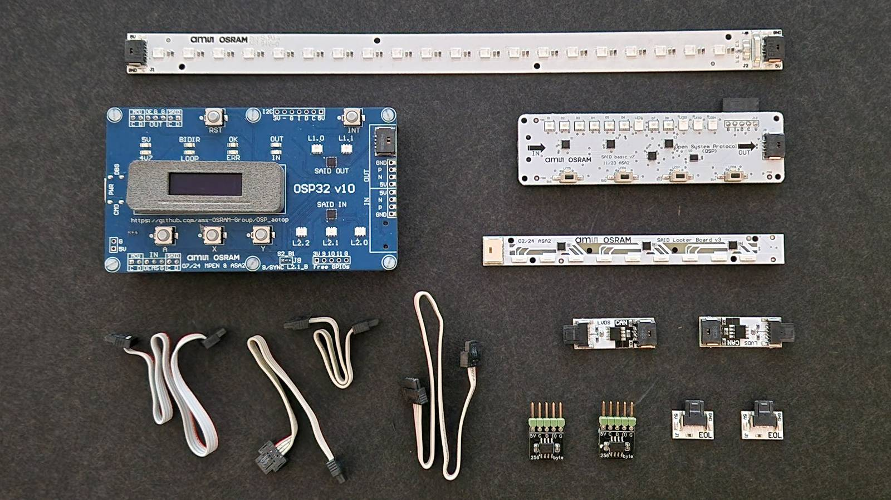
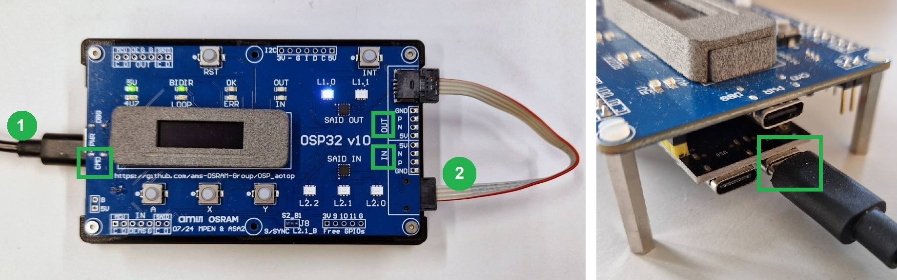
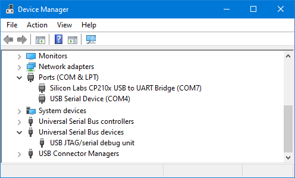

# Getting started with Open System Protocol (OSP) on Arduino

This document gives instructions to get started with the **aolibs**;
short for Arduino OSP libraries from ams-OSRAM. 
This suite implements support for chips that use the
[Open System Protocol](https://ams-osram.com/technology/open-system-protocol), 
like the AS1163 ("SAID") or the OSIRE E3731i ("RGBI").


## Introduction

The _aolibs_ are typically used with the **Arduino OSP evaluation kit**,
depicted below.



The kit consists of a _Root MCU board_, some OSP _demo boards_, and 
some parts for "wiring" them up. The OSP demo boards are typically strips 
with some RGBIs, some SAIDs, and/or some I2C devices. One example 
is the _SAIDlooker_ board. 


OSP demo boards are connected to a Root MCU board. 
A Root MCU board is a board at the root of an OSP chain.
It contains an MCU that controls the OSP chain.
The Root MCU board in the Arduino OSP evaluation kit is the _OSP32_ board.


At the back of the OSP32 board is an _ESP32S3_ on a 
standard development board known as "ESP32-S3-DevKitC-1" (black).


The _aolibs_ are libraries to create an OSP control firmware for the 
ESP32S3. The libraries are intended to be used with the 
[_Arduino_](https://www.arduino.cc/) IDE.

This document describes how to get started with the
_aolibs_ in the Arduino IDE. It shows how to compile 
an Arduino sketch, e.g. an example from one of the _aolibs_,
upload it to the ESP32 in the OSP32 board, and see it
drive LEDs on one of the demo boards.


## Prerequisites

The following items are needed to get started with software development
on the OSP32 board with the _aolibs_.

- Desktop/laptop with and install rights.  
  The developers of the _aolibs_ use Windows, but Linux or Mac should also work.
- Internet connection (to download IDE, compiler, libraries).
- Target hardware, e.g. from the 
  [Arduino OSP evaluation kit](https://ams-osram.com/products/boards-kits-accessories/kits/ams-as1163-qf-evm-kt-osp-evaluation-kit),
  like

  - OSP32 board (but some simple examples also work with just an ESP32).
  - One ERNI Minibridge cable and/or a terminator.
  - Optional some OSP demo boards (e.g. RGBIstrip, SAIDlooker, SAIDbasic).


## Installation

1. **Install Arduino IDE**  
   From the Arduino website, [download](https://www.arduino.cc/en/software) 
   and install Arduino IDE.
   
   Section [versions](#versions) lists which versions are tested to work.
   We recommend to use the latest versions (for the Arduino IDE, and also for 
   the board package mentioned below). Only when you have problems revert to
   the versions listed there.

2. **Install "board" (compiler)**  
   The ESP32S3 compiler (tools, runtime) needs to be installed in the Arduino IDE.

   Use the BOARDS MANAGER to search for "ESP32" and install the board 
   "esp32 by **Espressif Systems**".
   Do not confuse the Espressif board packages with the one from Arduino 
   ("Arduino ESP32 Boards by **Arduino**").
   
   
 
   In the unlikely case that the board is not listed, add 
   `https://raw.githubusercontent.com/espressif/arduino-esp32/gh-pages/package_esp32_index.json`
   to "File > Preferences > Additional boards manager URLs"
 
3. **Install driver for USB to UART bridge** (probably can be skipped)  
   The OSP32 boards use an _ESP32-S3-DevKitC-1_ with an USB to UART Bridge (CP2102N).
   Plug a USB cable from the PC to the ESP32S3 USB connector labeled **CMD** and 
   check the Windows device manager if the bridge is recognized.
 
   
 
   Normally, the board manager also installs drivers for various bridges. 
   If missing, download and install it from 
   [Silabs](https://www.silabs.com/interface/usb-bridges/usbxpress/device.cp2102n-gqfn28).
 
4. **Install aolibs**  
   The _aolibs_ (OSP libraries) need to be installed in the Arduino IDE.
   There are several libraries 
   (`aoresult`, `aospi`, `aoosp`, `aocmd`, `aomw`, `aoui32`, `aoapps`, and `aotop`)
   but `aotop` has all others as dependencies, so installing that one, installs all.
   
   Use the LIBRARY MANAGER to search for "aotop" and install 
   **OSP ToplevelSketches aotop** (latest version).
   
   
 
   As an (not recommended) alternative, get all the _aolibs_ manually, 
   e.g. download them from [GitHub](https://github.com/ams-OSRAM/OSP_aotop),
   and copy them into the Arduino `libraries` directory
   (e.g. to `C:\Users\John\Documents\Arduino\libraries\OSP_aotop`).
 
5. **Flash an example**  
   Finally, we flash some firmware into the ESP32 that will send OSP
   telegrams to blink an RGB LED.
   
   Connect the OSP32 board to the PC: plug a USB cable
   to the USB plug labeled **CMD** on the OSP32 PCB ("UART" on the ESP PCB). 
   With one of the ERNI cables supplied with the evaluation kit, 
   connect the connector labeled OUT with the connector labeled IN,
   both on the OSP32 board right-hand side edge.
   
   

   Start Arduino IDE. Select an example sketch, e.g. try `aoosp_min.ino`. 
   It is a minimalist example sketch that blinks the first LED connected to 
   the first SAID ("OUT") on the OSP32 board (using both BiDir and Loop mode).
   You can find the example in the Arduino IDE via "File > Examples > OSP Telegrams aoosp > aoosp_min".
   
   

   Select the correct board (compiler) "ESP32S3 Dev Module" and correct 
   Serial port (here COM7), then (compile and) Upload, either via the button 
   bar (the arrow for Upload) or via Sketch > Upload.
   
   

   Watch the serial output by opening the serial monitor, either via the
   button bar (magnifying glass), or via Tools > Serial Monitor. 
   Ensure the Serial Monitor baud rate is set to 115200.
 
   
   
   What you should see  is that the first RGB (L1.0) of SAID OUT (on the 
   OSP32 board) blinks bright white and dim white. First in BiDir mode 
   (so direction mux led is green) then in loop (led is orange).
   Then repeats.


## Maximalist example

The biggest example in the _aolibs_ is the the full fledged demo 
`aotop\examples\saidbasic`. It runs on the OSP32 board with SAIDbasic 
connected to it (either in Loop or in Bidir).

The demo has several so-called "apps" integrated: running LED, 
scripted animation (script in EEPROM), country flags selected by 
pressing a button, and showing the effect of dithering. 

Use the A button to select app after app.
There is a small [user manual](extras/manuals/saidbasic.pptx)
available for the saidbasic demo.


## Next examples

In the Installation section the example `aoosp_min.ino` was run. 
This example controls an OSP chain by sending command telegrams and 
interpreting response telegrams. Most applications will be at this level.

There is also an example that is more _low-level_: `aospi_tx`.
Here the Arduino sketch composes byte-arrays to send commands.
This level is good for getting insights in OSP, especially for 
border cases like erroneous telegrams.

There is also an example that is more _high-level_: `aomw_min`.
This uses the topology builder from the middleware library. 
It forms a topology map of all nodes of the OSP chain. Next, it sets the color 
of RGB triplets. This abstracts away that a SAID has three RGB triplets 
and an RGBI one, that they use different drive currents, and that 
they need different telegrams for setting the LED PWM.

Finally, the `aotop` library contains the demo `osplink`.
This adds a commands interpreter to the firmware running on the ESP32.
When that is flashed, open the Serial Monitor at 115200 baud and give commands
(suggested start is `help` and `help osp`). The command interpreter
has commands for the same three levels. With `osp tx` raw bytes
can be sent, with `osp send` telegrams can be send, and `topo` allows
controlling triplets.

For example send the below OSP telegrams.
The last command is sent to node 001 (SAID OUT), asking channel 01 
(second triplet) to switch to red=3FFF, green=0000 and blue=7FFF.
The AA in the telegram is a dummy for padding.

```
>> osp send 000 reset
tx A0 00 00 22
rx none ok

>> osp dirmux loop
dirmux: loop

>> osp send 001 initloop
tx A0 04 03 86
rx A0 09 03 00 50 63 ok

>> osp send 000 clrerror
tx A0 00 01 0D
rx none ok

>> osp send 000 goactive
tx A0 00 05 B1
rx none ok

>> osp send 001 setpwmchn 01  AA  3f ff  00 00  7f ff
tx A0 07 CF 01 AA 3F FF 00 00 7F FF FE
rx none ok
```

The feedback from the above session shows what raw byte are sent. 
We can hand compose those and use the low-level `tx` command (or `trx` when
a response is expected such as for the second telegram).
Note that in the last command we ask the command interpreter to compute
the CRC for us.

```
>> osp tx A0 00 00 22
tx A0 00 00 22
rx none ok

>> osp trx A0 04 03 86
tx A0 04 03 86
rx A0 09 03 00 50 63 ok

>> osp tx A0 00 01 0D
tx A0 00 01 0D
rx none ok

>> osp tx A0 00 05 B1
tx A0 00 05 B1
rx none ok

>> osp tx A0 07 CF 01 AA 3F FF 00 00 7F FF crc
tx A0 07 CF 01 AA 3F FF 00 00 7F FF FE
rx none ok
```

And finally a session that uses topo, which achieves the same result.

```
>> topo build
topo: nodes(N) 1..2, triplets(T) 0..4, i2cbridges(I) 0..0, dir loop

>> topo pwm 1  3fff 0000 7fff
pwm T1: 3FFF 0000 7FFF
```

There is an introduction about the command interpreter in its library
[documentation](https://github.com/ams-OSRAM/OSP_aocmd?tab=readme-ov-file#example-commands).


## Documentation

There are several sources of documentation:

- **Readme**  
  Every _aolib_ comes with documentation in the form of a `readme.md` 
  in its root directory, e.g. `arduinoosp\aolibs\aospi\readme.md`.
  
  These readme's give a quick intro to that library, presents all 
  examples of the library, discusses the modules and their inter 
  dependencies, and gives a high level overview of the API of the library.
  There might be dedicates sections to explain for example the
  execution, file or module architecture. The readme finishes with the 
  version history.

  The `readme.md` of _aospi_ deserves reading, especially the section 
  ["System overview"](https://github.com/ams-OSRAM/OSP_aospi/tree/main?tab=readme-ov-file#System-overview).
  
  The `readme.md` of _aocmd_ explains the [command interpreter](https://github.com/ams-OSRAM/OSP_aocmd?tab=readme-ov-file#example-commands),
  it is suitable for quick (OSP) experiments without programming.

- **Examples**  
  Every _aolib_ comes with examples, find them via 
  "File > Examples > ams-OSRAM OSP xxx > ...".
  
  This ranges from simple software 
  [examples](https://github.com/ams-OSRAM/OSP_aoresult/tree/main/examples) 
  (how to assert, how to print errors, how to compute CRC), using the 
  [communications](https://github.com/ams-OSRAM/OSP_aospi/tree/main/examples) 
  layer (tx, rx, timing), trying 
  [OSP features](https://github.com/ams-OSRAM/OSP_aoosp/tree/main/examples)
  (error behavior, grouping/multicast, I2C, OTP, SYNC, topology, clustering, serial cast), demonstrating the 
  [command interpreter](https://github.com/ams-OSRAM/OSP_aocmd/tree/main/examples) 
  (adding your own command), 
  [middleware features](https://github.com/ams-OSRAM/OSP_aomw/tree/main/examples)
  (topology manager, I/O-expander driver, EEPROM driver, animation script),
  using the OSP32 [user interface elements](https://github.com/ams-OSRAM/OSP_aoui32/tree/main/examples) 
  (buttons, signaling LEDs, OLED), reusable 
  [apps](https://github.com/ams-OSRAM/OSP_aoapps/tree/main/examples), 
  and finally the official applications 
  [saidbasic](examples/saidbasic) and [osplink](examples/osplink).

  The `readme.md` of every library shortly describes each example.

- **Training slides**  
  There are [slides](extras/manuals/ArduinoOSP-Training.pptx) for a training 
  on _aolibs_ with the _Arduino OSP evaluation kit_. They come with exercises, see the 
  `training` examples in [aotop](https://github.com/ams-OSRAM/OSP_aotop/tree/main/examples).

- **API documentation**  
  In every _cpp_ file (not in the header file), 
  the public functions have a javadoc section, e.g. 

  ```cpp
  /*!
    @brief  Sends RESET and INIT telegrams, auto detecting BiDir or Loop.
    @param  last
            Output parameter returning the address of
            the last node - that is the chain length.
    @param  loop
            Output parameter returning the communication direction:
            1 iff Loop, 0 iff BiDir.
    @return aoresult_ok          if all ok,
            aoresult_sys_cabling if cable or terminator missing
            or other error code
    @note   Output parameters are undefined when an error is returned.
    @note   `last` and `loop` maybe NULL (avoids caller to allocate variable).
            Node that `last` is also available via aoosp_exec_resetinit_last(),
            and loop is available via aospi_dirmux_is_loop().
    @note   Controls the BiDir/Loop direction mux via aospi_dirmux_set_xxx.
  */
  aoresult_t aoosp_exec_resetinit(uint16_t *last, int *loop) {
    ...
  }
  ```


## Versions

In general, take the latest greatest of all components. If there are 
problems, these are the versions the _aolib_ developers used and tested.

- Arduino IDE 2.3.4.
- Board manager "esp32 by Espressif Systems" 3.1.1.
- No external libraries are used.
- As PCB the OSP32 v10 and SAIDbasic v7.

In Arduino, we have _File > Preferences > Compiler warnings > All_ to have the
highest checking level during development. At the moment of writing this
statement, a compile results in no errors or warnings.


## Which libraries to use

The _aolibs_ support software ranges from basic to complete demos.
Depending on your needs pick a subset from the following set.

- `aoresult`  
  This library is "empty"; it only contains the global list (enum) of error 
  codes used by the other libraries; it also implements a simple `assert`.
  
- `aospi`  
  This library implements the 2-wire SPI communication needed to send 
  telegrams to an OSP chain and receive responses from it. Sending and 
  receiving is on the level of byte arrays.
  
  The application is responsible to ensure the buffer contains the OSP 
  preamble, the destination address, the payload size, the telegram ID, and 
  its parameters and finally a matching CRC. All bits packed according to 
  the OSP standard.
  
  The OSP32 board has a mux to chose between two OSP configurations 
  ("loop" and "bidir"). This library also has function to control that mux.
  
  If you use a different protocol (e.g. 1-wire SPI), a different MCU 
  (e.g. NXP S32K144 instead of ESP32S3) or less flexibility (e.g. no 
  BiDir/Loop with auto select), this library would be replaced.

- `aoosp`  
  This library implements OSP communication at telegram level 
  (on top of `aospi`). The API has a function per telegram, with as 
  argument the address and the telegram parameters. The library does the 
  packing of byte buffers (and unpacking from byte buffers for responses).
  
  The library also contains some "macros": functions that send multiple 
  telegrams implementing a higher level function like an I2C read 
  transaction to an i2C device connected to a SAID.
  
  Any application for OSP is expected to use the libraries `aoosp` 
  on top of `aospi` on top of `aoresult`.

- `aocmd`  
  Implements a command interpreter and several commands (on top of `aoosp`).
  This is a bridge from serial-over-USB to `aoosp` (and `aospi`).
  It allows connecting a PC to the OSP32 board, and passing commands from 
  the PC to the ESP32, typically resulting in OSP telegrams being send and 
  received.
  
  This library is useful in the evaluation kit because it offers human
  interaction either direct typing in a terminal, or via a PC app that
  gives commands via serial-over-USB. Production firmware images are 
  not expected to use `aocmd`.

- `aomw`  
  This library contains an assortment of software features. The most 
  prominent one is the topology builder. It builds a map of the OSP chain, 
  making an abstraction of (an array of) RGB triplets irrespective if 
  they are an RGBI, or on a channel of a SAID.
  
  The library also contains a driver for an I2C EEPROM and an I2C 
  I/O-expander; both these devices are used as example I2C devices connected 
  to a SAID with I2C gateway enabled.
  
  The library also has a module to paint flags on an OSP chain, and 
  an interpreter for scripted animation instructions.
  
  All these help in making flexible demos, but are not expected in production
  firmware.

- `aoui32` 
  This library contains drivers for the UI elements on the OSP32 board: 
  the A, X and Y button, the red and green signaling LEDs and the OLED screen. 
  It does not depend on any other of the other libraries.

- `aoapps`  
  This library contains various apps. A top-level Arduino sketch can 
  include a subset of these apps by registering them with the application 
  manager. That is also in module in the library.

  This library thus contains demo apps, but those are not expected in 
  production firmware.
  
- `aotop`  
  This is not a library, rather it contains sketches for advanced top
  level applications. It also contains generic documentation (spanning
  all _aolibs_).


## Library naming 

Every public symbol in any of the libraries is prefixed with a library
specific "prefix", see table below. The table also lists the
URL of the repositories and the log of the registration of all repo 
releases at Arduino.


 | Arduino library name         | Prefix       |  Repository                                               | Registration                                                                          |
 |:-----------------------------|:------------:|:---------------------------------------------------------:|:-------------------------------------------------------------------------------------:|
 | OSP ToplevelSketches aotop   | aotop        | [OSP_aotop](https://github.com/ams-OSRAM/OSP_aotop)       | [log](https://downloads.arduino.cc/libraries/logs/github.com/ams-OSRAM/OSP_aotop/)    |
 | OSP ReusableApps aoapps      | aoapps       | [OSP_aoapps](https://github.com/ams-OSRAM/OSP_aoapps)     | [log](https://downloads.arduino.cc/libraries/logs/github.com/ams-OSRAM/OSP_aoapps/)   |
 | OSP UIDriversOSP32 aoui32    | aoui32       | [OSP_aoui32](https://github.com/ams-OSRAM/OSP_aoui32)     | [log](https://downloads.arduino.cc/libraries/logs/github.com/ams-OSRAM/OSP_aoui32/)   |
 | OSP Middleware aomw          | aomw         | [OSP_aomw](https://github.com/ams-OSRAM/OSP_aomw)         | [log](https://downloads.arduino.cc/libraries/logs/github.com/ams-OSRAM/OSP_aomw/)     |
 | OSP CommandInterpreter aocmd | aocmd        | [OSP_aocmd](https://github.com/ams-OSRAM/OSP_aocmd)       | [log](https://downloads.arduino.cc/libraries/logs/github.com/ams-OSRAM/OSP_aocmd/)    |
 | OSP Telegrams aoosp          | aoosp        | [OSP_aoosp](https://github.com/ams-OSRAM/OSP_aoosp)       | [log](https://downloads.arduino.cc/libraries/logs/github.com/ams-OSRAM/OSP_aoosp/)    |
 | OSP 2wireSPI aospi           | aospi        | [OSP_aospi](https://github.com/ams-OSRAM/OSP_aospi)       | [log](https://downloads.arduino.cc/libraries/logs/github.com/ams-OSRAM/OSP_aospi/)    |
 | OSP ResultCodes aoresult     | aoresult     | [OSP_aoresult](https://github.com/ams-OSRAM/OSP_aoresult) | [log](https://downloads.arduino.cc/libraries/logs/github.com/ams-OSRAM/OSP_aoresult/) |

The prefix is also used as an (informal) short name.


## Debugging

The Arduino IDE 2.x has an integrated debugger.
The ESP32S3 on the OSP32 has an integrated USB JTAG probe.
This means that, it suffices to connect
the PC running Arduino IDE with a USB cable to the ESP to 
have full debugging capabilities.
Follow these steps.

1. First connect the OSP32 board with **two** USB cables to the PC.
   
   
   
   One is connected to **CMD** (labeled UART on the ESP board), 
   this is for Serial interaction (and upload). The other is connected to 
   **DBG** (labeled USB on the ESP board), this is for debugging using JTAG.
   
   
   
   Confirm, in Device manager, that there are two USB ports active.
   
   
   
   The screenshot shows COM7 is the Serial connection (USB to UART bridge).
   This is associated to the USB cable plugged into the connector
   labeled **CMD**; it is a "singleton" device. The USB cable plugged 
   into **DBG** is actually a USB composite device. It surfaces as 
   a serial device COM4, but also as `USB JTAG/Serial debug unit`.
   
   [Some](https://youtu.be/HGB9PI3IDL0?si=t4-Lz4m5WLVTHXuL&t=978) claim to 
   need the tool [Zadig](https://zadig.akeo.ie) to use the **DBG** port. Zadig 
   replaces USB drivers so that "USB JTAG/serial debug uint (Interface 0)" is 
   mapped to driver "USB Serial (CDC) - usbser" and 
   "USB JTAG/serial debug uint (Interface 2)" is mapped to "WinUSB". 
   We did not use Zadig.
   
2. Make sure you have IDE 2.3.4.

   For a while, debugging was 
   [broken](https://forum.arduino.cc/t/arduino-ide-2-3-0-is-now-available/1221189), 
   So do not use versions below 2.3.4.

   
3. Configure a project, e.g. open example `saidbasic.ino`.

   Make sure to have selected `ESP32S3 Dev Module` and COM7 for Serial.
   
   We believe that for debugging only setting needs to be changed in the `Tools` menu.
   _TJAG adapter_ needs to be set to "Integrated USB JTAG"; all other all 
   ESP32S3 USB settings (CDC, DFU, MSC) can stay at "Disabled". 
   Also note we have (debugging or not) _Upload Mode_ at "UART0 / Hardware CDC", 
   and _USB Mode_ at "Hardware CDC and JTAG".
   
   
   
   Although not necessary, it makes debugging easier since code is less 
   optimized, it is suggested to enable Optimize for Debugging in the 
   `Sketch` menu. 
   
   
   
4. Compile and Upload as usual. Start debugging by pressing the third button
   in the button bar. Open the DEBUG pane via the side bar for the debugger 
   console.
   
   The figure below shows the debugger running `saidbasic.ino`.
   A break point is set in `aoosp_des_initloop()` the destructor (interpreter)
   of the response telegram of initloop. We gave (via Serial) the commands
   `app switch void` to disable the demo and `osp resetinit` to trigger a
   call to initloop.
   
   
   
   The VARIABLES section shows the received bytes: `size` is 6 and
   `tele.data` contains A0 09 03 00 50 63.
   We can pretty print that with the python script `OSP_aospi\python\telegram`
   on the PC (or with the command `osp fields A0 09 03 00 50 63` on the ESP).
   
   ```
   (env) ...\OSP_aospi\python\telegram>run A0 09 03 00 50 63
             +---------------+---------------+---------------+---------------+---------------+---------------+
   byteval   |      A0       |      09       |      03       |      00       |      50       |      63       |
   byteix    |0 0 0 0 0 0 0 0|1 1 1 1 1 1 1 1|2 2 2 2 2 2 2 2|3 3 3 3 3 3 3 3|4 4 4 4 4 4 4 4|5 5 5 5 5 5 5 5|
   bitix     |7 6 5 4 3 2 1 0|7 6 5 4 3 2 1 0|7 6 5 4 3 2 1 0|7 6 5 4 3 2 1 0|7 6 5 4 3 2 1 0|7 6 5 4 3 2 1 0|
   bitval    |1 0 1 0 0 0 0 0|0 0 0 0 1 0 0 1|0 0 0 0 0 0 1 1|0 0 0 0 0 0 0 0|0 1 0 1 0 0 0 0|0 1 1 0 0 0 1 1|
             +-------+-------+-----------+---+-+-------------+-------------------------------+---------------+
   field     |preambl|      address      | psi |   command   |            payload            |      crc      |
   bin       | 1010  |    0000000010     | 010 |   0000011   |   00000000    :   01010000    |   01100011    |
   hex       |  0xA  |       0x002       | 0x2 |    0x03     |     0x00      :     0x50      |   0x63 (ok)   |
   meaning   |   -   |    unicast(2)     |  2  |  initloop   |       0       :      80       |    99 (ok)    |
             +-------+-------------------+-----+-------------+-------------------------------+---------------+
   ```

(end)
