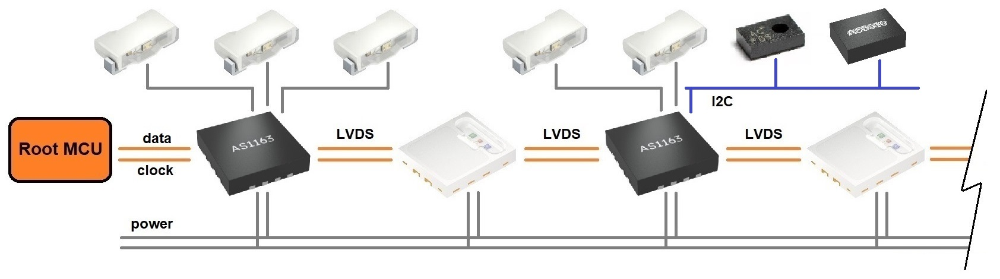
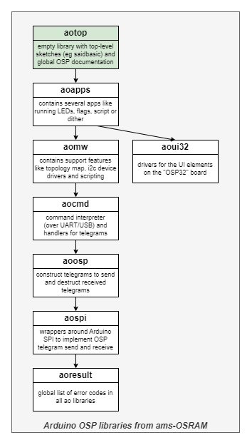

# Open System Protocol (OSP) on Arduino

Welcome to the landing page of the **aolibs** 
(short for Arduino OSP libraries from ams-OSRAM) 
to be used with the **Arduino OSP evaluation kit**.

## Introduction

OSP or Open System Protocol was developed by ams OSRAM for dynamic lighting,
for example in car interiors. OSP is open for everybody and free of license. 

An OSP based system consist of an MCU (the "Root MCU") connected to a series 
of (up to 1000) daisy chained OSP nodes. OSP nodes contain or drive (RGB) LED 
modules, or implement gateways to other protocols like I2C. The SAID or
Stand Alone Intelligent Driver, officially known as AS1163, is an example of
an OSP node with external LEDs and an integrated I2C bridge. The E3731i
or Intelligent RGB (RGBI) is an example of an OSP node with an integrated red, 
green and blue LED.

ams OSRAM supplies an evaluation kit demonstrating OSP. This kit is known as 
the _Arduino OSP evaluation kit_. With this evaluation kit comes 
software, which is partitioned over several libraries, the _aolibs_. 
Each library is stored in its own GitHub repository.
This document is part of one of those repositories/libraries known as _aotop_. 
However, _aotop_ is not really a library (with reusable code), but rather a 
container for top level demo applications (which use the real libraries), and 
a container for top-level documentation (like this readme and for example 
training material). The diagram below shows an overview of all _aolibs_.

All _aolibs_ (including _aotop_) are registered as Arduino libraries.
Library _aotop_ is registered as an Arduino library which is dependent 
on all others. 
Use the Library Manager of the Arduino IDE to search for _aotop_ 
("OSP ToplevelSketches aotop"), install it and all others will 
also be installed.

There is a dedicated [Getting started manual](gettingstarted.md).
It describes what hard and software is needed (the evaluation kit and 
the libraries), and how to turn on the first RGBs.

## Links

This section links to various resources.

- Open System Protocol [website](https://ams-osram.com/technology/open-system-protocol).

- Open System Protocol application note [OSP specification](https://look.ams-osram.com/m/46e569ad50283dc5/original/OSIRE-E3731i-Open-System-Protocol.pdf)
 ([previous](https://look.ams-osram.com/m/36bafc7159df087a/original/OSIRE-E3731i-Open-System-Protocol-1-0.pdf)).

- OSP products

  - RGBi [E3731i](https://ams-osram.com/products/leds/multi-color-leds/osram-osire-e3731i-krtbi-d2lm31-31) product page (OSP node with built-in RGB LEDs);
  - SAID [AS1163](https://ams-osram.com/products/drivers/led-drivers/ams-as1163-automotive-9-channel-stand-alone-intelligent-led-driver-ic) product page (OSP node with drivers for 9 external LEDs);
  - SAID [AS1163B](https://ams-osram.com/products/drivers/led-drivers/ams-as1163b-automotive-6-channel-stand-alone-intelligent-led-driver-ic) product page (OSP node with drivers for 6 external LEDs).

- [Landing page](https://github.com/ams-OSRAM/OSP_aotop) for the _aolibs_ 
  (Arduino OSP libraries from ams-OSRAM) on GitHub (this page).

  - [Getting started manual](gettingstarted.md);

  - [Training slides](extras/manuals/).

- [Arduino OSP evaluation kit](https://ams-osram.com/products/boards-kits-accessories/kits/ams-as1163-qf-evm-kt-osp-evaluation-kit)
  contains several boards, here are the (latest) [schematics](extras/schematics):

  - 1× OSP32 ([schematics](extras/schematics/OSP32_complete_v11.pdf)): root MCU board with an ESP32 (flashed with the [saidbasic](examples/saidbasic) demo), two SAIDs, and an I2C EEPROM (not flashed);
  - 1× SAIDbasic ([schematics](extras/schematics/SAIDbasic_complete_v8.pdf)): demo board with 3 SAID and 4 RGBIs, I/O-expander and I2C EEPROM flashed with [rainbow](examples/eepromflasher) script;
  - 1× RGBIstrip ([schematics](extras/schematics/OSIRE_E3731i_V2.3.pdf)): demo board with 20 RGBIs;
  - 1× SAIDlooker ([schematics](extras/schematics/SAIDLooker_complete_v4.pdf)): demo board with 3 SAIDs;
  - 2× Terminator ([schematics](extras/schematics/Terminator_complete_v3.pdf));
  - 2× EEPROM stick ([schematics](extras/schematics/I2CEEPROMstick-schematics_v2.pdf)): EEPROMs flashed with respectively the [bounceblock](examples/eepromflasher) and [colormix](examples/eepromflasher) script;
  - 2× CAN adapter ([schematics](extras/schematics/CANadapter_complete_v3.2.pdf));
  - 4× ERNI cable ([supplier](https://www.distrelec.nl/en/ribbon-cable-27mm-cores-200mm-black-erni-839017/p/14362654)).
  
- The [aolibs](https://github.com/orgs/ams-OSRAM/repositories?q=OSP_ao)
  (on the ams OSRAM GitHub [site](https://github.com/ams-OSRAM/)): 

  - [aotop](https://github.com/ams-OSRAM/OSP_aotop) (this repo) with _Top level sketches_;
  - [aoapps](https://github.com/ams-OSRAM/OSP_aoapps) library with _Reusable apps_;
  - [aoui32](https://github.com/ams-OSRAM/OSP_aoui32) library with _UI drivers for OSP32 board_;
  - [aomw](https://github.com/ams-OSRAM/OSP_aomw) library with _Middleware_;
  - [aocmd](https://github.com/ams-OSRAM/OSP_aocmd) library with a _Command interpreter_;
  - [aoosp](https://github.com/ams-OSRAM/OSP_aoosp) library with _Telegrams_;
  - [aospi](https://github.com/ams-OSRAM/OSP_aospi) library with a _2-wire SPI_ driver;
  - [aoresult](https://github.com/ams-OSRAM/OSP_aoresult) library with _Result codes_.

(end of top-level documentation)

-----------------------------------------------------------------------------
-----------------------------------------------------------------------------

(begin of library specific documentation)

# OSP ToplevelSketches aotop

Library "OSP ToplevelSketches aotop", usually abbreviated to "aotop", 
is one of the **aolibs**; short for Arduino OSP libraries from ams-OSRAM.
This suite implements support for chips that use the Open System Protocol, 
like the AS1163 ("SAID") or the OSIRE E3731i ("RGBi").
The landing page for the _aolibs_ is on 
[GitHub](https://github.com/ams-OSRAM/OSP_aotop).

## Introduction

Library _aotop_ is at the top of the dependency graph.
It contains no (library) code; but it serves several other functions.
- It contains top-level sketches for advanced demos 
  (using the Arduino IDE examples mechanism).
  See next section for an overview.
- It is made dependent on all Open System Protocol libraries (aolibs),
  so installing _aotop_ via the Arduino IDE will install all other 
  libraries as well.
- It is the "landing" place for the Open System Protocol software,
  providing global documentation (Getting Started, Training) with 
  links to all related resources.

## Examples

The examples in _aotop_ are not examples in the Arduino IDE sense 
(explaining a feature), rather they are full-fledged (demo) applications.
You can find them in the Arduino IDE via 
File > Examples > OSP ToplevelSketches aotop > ...

- **saidbasic** ([source](examples/saidbasic))  
  This is an official application (centered around the SAIDbasic board). 
  This demo contains 4 apps: scripted animation (from EEPROM), running LED, 
  (country) flags selected by pressing a button, and a dithering demo. 
  It comes with a [user manual](extras/manuals/saidbasic.pptx).
  
- **eepromflasher** ([source](examples/eepromflasher))  
  One of the features of the `saidbasic` application is to play (LED animation)
  scripts from an EEPROM. There are EEPROMs on the OSP32 board, the SAIDbasic
  board, and on stand-alone I2C EEPROM sticks. This `eepromflasher` application
  allows writing any script (stock or user developed) to any of these EEPROMs.
  The stock scripts are `rainbow`, `bouncingblock`, `colormix`, and `heartbeat`.

- **osplink** ([source](examples/osplink))  
  This is another official application. 
  It allows the PC (with a terminal like the Arduino Serial 
  Monitor) to send and receive OSP telegrams, using serial-over-USB. 
  There is  [documentation](https://github.com/ams-OSRAM/OSP_aocmd?tab=readme-ov-file#example-commands)
  on using the command interpreter.
  There is also an experimental Python app for PC
  [`aocmd/python`](https://github.com/ams-OSRAM/OSP_aocmd/tree/main/python), 
  that sends commands to the `osplink` application.

- **training** ([source](examples/training1), [source](examples/training2), [source](examples/training3))  
  These are exercises for the [training](extras/manuals/).

## API

This library does not contain (reusable library) code, so there is no API.

The only exception is the macro `AOTOP_VERSION` (in `aotop.h`), 
which identifies the version of this "library".

## Version history _aotop_

- **2025 March 3, 0.2.0**
  - Added schematics of (new versions of) the various boards in the EVK.
  - Improved description of USB settings in getting Started > Debugging.
  - Added training slides.
  - New picture in Getting Started for USB/CMD.
  - Updated link to latest OSP specification.
  - Switched to ESP32 board (compiler) 3.1.1 in Arduino IDE.
  - Switched to Arduino IDE 2.3.4 (debugging supported).
  - Fixed typos in `readme.md`.

- **2024 November 29, 0.1.7**
  - Version update: ESP32 from 3.0.5 to 3.0.7.
  - Updated OSP system picture.
  - Text corrections, improved images and extra links in `readme.md` and `gettingstarted.md`.
  
- **2024 November 8, 0.1.6**  
  - New image for evaluation kit; link added.
  - Added schematic for RGBI strip `OSIRE_E3731i_V2.3.pdf`.
  - OSP system picture now has two I2C devices.
  - Replaced OSP32 schematics v9 by v10.
  - Now 4 cables in EVK.
  - Updates to `readme.md`.
  - osplink 1.8 now prints all library versions.
  
- **2024 October 25, 0.1.5**  
  - Replaced OSP system picture with one having also a SAID with I2C.
  - Improved labels of links.
  
- **2024 October 24, 0.1.4**  
  - Added URLs for SAID, SAIDB and Arduino OSP evaluation kit.
  - Getting Started, section Debugging, explains the USB ports in more detail.

- **2024 October 23, 0.1.3**  
  - In `saidbasic.ino` started app before command interpreter.
  - Added debugging section in Getting Started.

- **2024 October 11, 0.1.2**  
  - Made library version accessible in code (`AOTOP_VERSION`) and added to `saidbasic`.
  - Improved _Installation_ of _Getting Started_ with new and more screenshots.
  - Better comments in `eepromflasher.ino` and `saidbasic.ino`.
  - Fixed links to training and OSP specification.

- **2024 October 8, 0.1.1**  
  - Updated intro section of getting started (added pictures).
  - Added `examples\training[123].ino`.
  - Added `extras\manuals\ArduinoOSP-Training.pptx`.
  
- **2024 October 8, 0.1.0**  
  - Fixed name to `Open System Protocol (OSP) on Arduino` and `aolibs`.
  - Moved domain from `github.com/ams-OSRAM-Group` to `github.com/ams-OSRAM`.
  - Added user manual (ppt) to `saidbasic.ino`.
  - Changed `eepromflasher.ino` to _compare_ SAIDbasic eeprom to rainbow.
  - Adapted to `aoosp_exec_resetinit` not needing `last` and `loop`.
  - Added links in `readme.md` for all example sketches.
  - Updated `ospchain.jpg`.
  - Extended `gettingstarted.md`.
  - Added minimal documentation to top of `saidbasic.ino`.
  - Corrected link to all GitHub repos from aoxxx to OSP_aoxxx.
  - Remove "oalib" from `sentence=` in `library.properties`.
  - Updated `readme.md`.
  - Arduino name changed from `OSP Top level sketches - aotop` to `OSP ToplevelSketches aotop`.
  - `license.txt` line endings changed from LF to CR+LF.
  - Reorder libs in `aocmd_version_extra()` in `saidbasic.ino`.
  - Added `extra\schematics\xxx.pdf` of all boards in the evaluation kit.
  
- **2024 July 2, 0.0.1**  
  - Initial release candidate.

(end)
